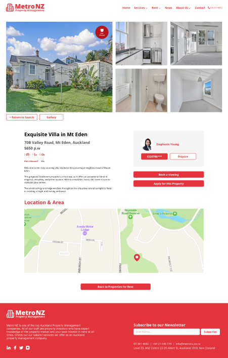
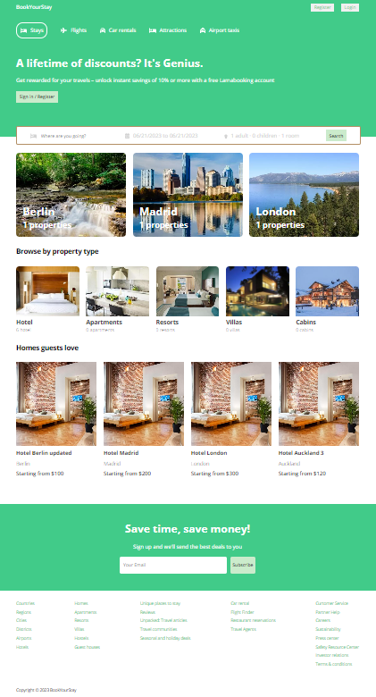
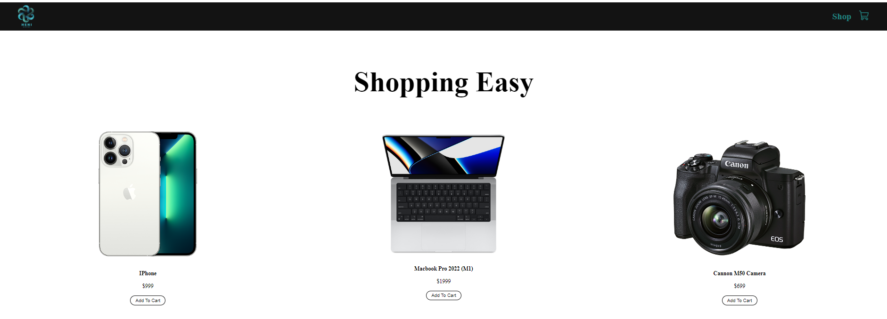

# ✌️ The Full Stack with Heni 

**`I develop, my community develops (Developer/Empath/Community)`**

- 👶🏽 Full stack newbie 

- 💪🏽 Frontend web development ~ somewhat confident

- 🫤 Backend web development ~ wip 

 

Hi 👋🏽 The name is Heni and I am from Aotearoa New Zealand. I'm a newbie full-stack web developer, thus narrowed my focus to areas of perceived strength until my experience grows. Take a look! 🤩

---

 

#

### 🦾 Perceived strengths = Focus

- FRONT END DEVELOPMENT | ReactJS, HTML, CSS, JavaScript
- BACKEND DEVELOPMENT | Express, NodeJS
- MISCELLANEOUS | MongoDB 

### 🧰 Languages and Tools

---

 

#

### 📺 Projects 

    
    
    

---

 

####  Thanks for taking a peep! ✌️ 

